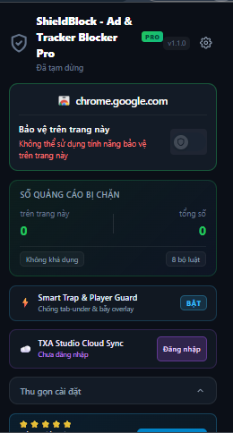
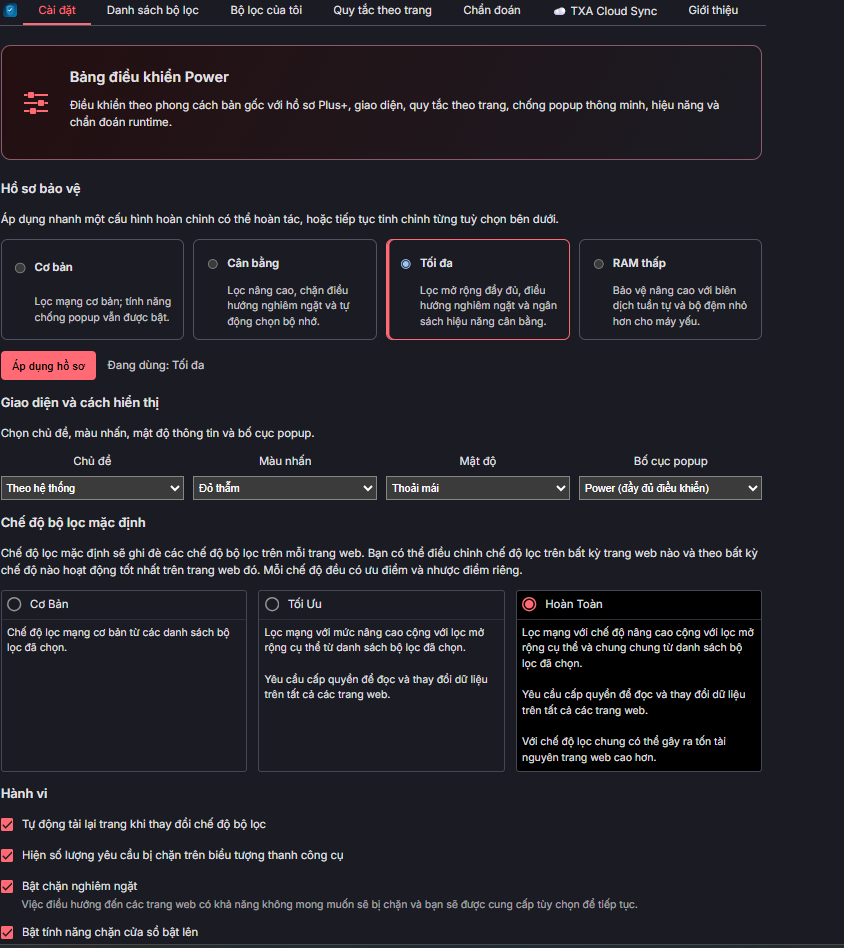
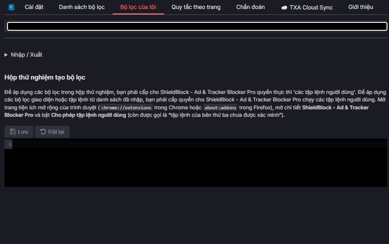
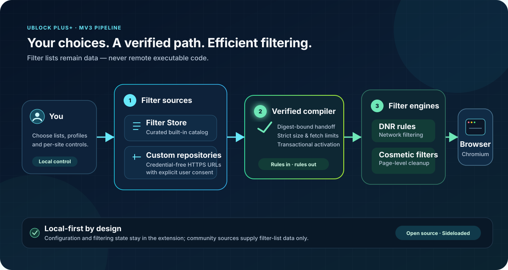

<!-- readme-refresh-pending -->
> **翻訳の更新状況：** この旧版の翻訳は、2026年9月6日のドキュメント更新をまだ完全には反映していません。最新のChrome画面、インストール手順、テスト結果は [English](../README.md) または [Tiếng Việt](README.vi.md) を参照してください。公開済みプレビュー版は最新ソースより古い場合があります。

<div align="center">


# ShieldBlock - Ad & Tracker Blocker Pro

### コミュニティの力で作る、Chromium Manifest V3向けコンテンツブロッカー

**サイドロード優先 · ローカル優先 · オープンソース · ユーザーによる制御**

[](https://chromewebstore.google.com/detail/neajkofkkadimcabbhekjcgdbbkfpfll)
[](https://github.com/TXAVL/ShieldBlock/actions/workflows/mv3-chromium.yml)
[](https://github.com/TXAVL/ShieldBlock/releases)
[](#quick-start)
[](ARCHITECTURE.md)
[](../LICENSE.txt)

[English](../README.md) · [Deutsch](README.de.md) · [Español](README.es.md) · [Français](README.fr.md) · [**日本語**](README.ja.md) · [한국어](README.ko.md) · [Русский](README.ru.md) · [Tiếng Việt](README.vi.md) · [简体中文](README.zh_CN.md) · [繁體中文](README.zh_TW.md)

[**最新のプレビューをダウンロード**](https://github.com/TXAVL/ShieldBlock/releases) · [機能一覧](FEATURE-MATRIX.md) · [アーキテクチャ](ARCHITECTURE.md) · [Filter Store](FILTER-STORE.md) · [ロードマップ](ROADMAP.md)

<p align="center">
  <a href="https://chromewebstore.google.com/detail/neajkofkkadimcabbhekjcgdbbkfpfll">
    
  </a>
</p>

</div>

---

ShieldBlockは、Chromium MV3向けに独立して開発されているGPLライセンスのコンテンツブロッカーです。実績のある上流のフィルタリング／コンパイラ基盤に、コミュニティのFilter Store、移行可能な設定、明示的な上級者向け制御、メモリを意識した動作を組み合わせています。プロジェクト運営のテレメトリサービスやリモート実行コードは使用しません。

> [!IMPORTANT]
> **🚀 クイックインストール（推奨）：** **[Chrome Web Store](https://chromewebstore.google.com/detail/neajkofkkadimcabbhekjcgdbbkfpfll)** から直接インストールすると、ZIPをダウンロードすることなく自動更新で利用できます。
>
> **手動インストール（開発者向け / Unpacked）：** [GitHub Releases](https://github.com/TXAVL/ShieldBlock/releases) から `ShieldBlock_*.chromium.zip` と `.sha256` をダウンロードしてください。サイドロードはChrome Web Storeの配布ポリシーを回避しますが、DNRの制限やService Workerのライフサイクル、ブラウザのセキュリティ境界を解除するものではありません。[互換性マトリクス](FEATURE-MATRIX.md) を参照してください。

## 選択権を中心にした設計

<p align="center">

<br><strong>Popup</strong>
</p>

<p align="center">

<br><strong>Option</strong>
</p>

<p align="center">

<br><strong>Custom Filter</strong>
</p>

<a id="quick-start"></a>

## クイックスタート

<div align="center">


</div>

### リリースをインストール

1. [GitHub Releases](https://github.com/TXAVL/ShieldBlock/releases)から`ShieldBlock_*.chromium.zip`と対応する`.sha256`ファイルをダウンロードします。
2. チェックサムを検証してから、ZIPを固定のフォルダーに展開します。
3. `chrome://extensions`または`edge://extensions`を開きます。
4. **デベロッパーモード**を有効にし、**パッケージ化されていない拡張機能を読み込む**を選び、`manifest.json`を含む展開先フォルダーを指定します。
5. Chrome 138以降では拡張機能の**詳細**ページを開き、**ユーザースクリプトを許可**を有効にします。Chrome 130～137では、代わりに全体の**デベロッパーモード**スイッチを使用します。インストール後にいずれかのスイッチを変更した場合は、拡張機能カードの**再読み込み**をクリックし、Service Workerのコンテキストに新しいAPI状態を認識させてください。これにより、対応するインポート済みコスメティックフィルタと、同梱許可リスト内のスクリプトレットを登録できます。Chromeの[`userScripts`ガイド](https://developer.chrome.com/docs/extensions/reference/api/userScripts)も参照してください。

> [!NOTE]
> サイドロードした拡張機能はChrome Web Store経由では更新されません。[Releases](https://github.com/TXAVL/ShieldBlock/releases)を確認し、新しいバージョンが公開されたら展開済みビルドを置き換えてください。このリポジトリのアーティファクトだけをインストールし、提供されるSHA-256チェックサムを検証してください。

<details>
<summary><strong>Windowsでリリースのチェックサムを検証</strong></summary>

```powershell
(Get-FileHash .\ShieldBlock_1.1.1.chromium.zip -Algorithm SHA256).Hash
Get-Content .\ShieldBlock_1.1.1.chromium.zip.sha256
```

16進ハッシュは一致していなければなりません（大文字と小文字は区別されません）。

</details>

### ソースからビルド

要件: Chrome／ChromiumまたはEdge 130以降、サブモジュールを扱えるGit、Node.js 22以降、ビルド時のフィルタデータ取得に必要なネットワーク接続。

<details open>
<summary><strong>Windows / PowerShell</strong></summary>

```powershell
git clone --recurse-submodules https://github.com/TXAVL/ShieldBlock.git
cd ShieldBlock
$version = (Get-Content -Raw package.json | ConvertFrom-Json).version
.\tools\make-mv3.ps1 -Platform chromium -Version $version
```

</details>

<details>
<summary><strong>Linux / macOS</strong></summary>

```bash
git clone --recurse-submodules https://github.com/TXAVL/ShieldBlock.git
cd ShieldBlock
make mv3-chromium

# 任意: バージョン付きZIPとSHA-256ファイルも作成します。
VERSION=$(node -p "require('./package.json').version")
tools/make-mv3.sh chromium "$VERSION"
```

</details>

ブラウザの拡張機能ページから`dist/build/ShieldBlock.chromium`を読み込んでください。バージョンを指定したPowerShellコマンドと、任意のバージョン付きシェルコマンドは、`dist/build/`にZIPとチェックサムを作成します。通常の`make mv3-chromium`は展開済みディレクトリだけを作成します。

## 仕組み

<div align="center">



</div>

- Chrome DNRは、リクエストごとにService Workerを起動することなくネットワークフィルタリングを処理します。
- イベント駆動型Service Workerは、設定、カタログ状態、移行、復旧可能なルール更新を管理します。
- インポートしたリストはローカルでDNRおよびコスメティックデータにコンパイルされます。スクリプトレットは、あらかじめ同梱の許可リストに存在する必要があります。
- オフスクリーンでのコンパイルは一時的で、処理が完了すると閉じます。

[アーキテクチャを読む](ARCHITECTURE.md) · [Power Runtimeを見る](POWER-RUNTIME.md) · [脅威モデルを確認](THREAT-MODEL.md) · [プライバシーについて](PRIVACY.md) · [コミュニティ調査を読む](COMMUNITY-RESEARCH.md)

## セキュリティと信頼境界

| 境界 | プロジェクトの規則 |
| --- | --- |
| リモートソース | HTTPSカタログとリストは上限付きデータとして解析され、リダイレクト、不正なスキーマ、実行可能なペイロードは拒否されます。 |
| Filter Storeの信頼性 | 組み込み項目とカスタム項目には信頼レベルが表示されます。コミュニティでの人気だけで項目が`verified`に昇格することはありません。 |
| 拡張機能コード | JavaScript、スクリプトレット、リダイレクトリソースは、レビュー済みの拡張機能パッケージ内に同梱され、実行時URLから取得されることはありません。 |
| 権限 | 中核となるフィルタリング権限は文書化されています。Chromeの`privacy`権限は、ユーザーが該当する制御を有効にした場合にだけ要求され、取り消せます。 |
| ローカルデータ | 設定、コンパイル済みフィルタ、ストレージ容量の診断は、ユーザーが明示的にエクスポートしない限り端末内に留まります。 |
| リリースの完全性 | CIはChromiumアーティファクトをビルドして検証し、リリースにはSHA-256チェックサムが含まれます。 |

セキュリティ上の問題は、公開Issueではなく[GitHub Security Advisories](https://github.com/TXAVL/ShieldBlock/security/advisories/new)から非公開で報告してください。報告方針は[SECURITY.md](../SECURITY.md)を参照してください。

## MV3の能力と正直な制約

| 現在利用可能 | MV3による制約 | 将来の研究—任意 |
| --- | --- | --- |
| DNRネットワークブロック、コスメティックフィルタリング、同梱スクリプトレット、カスタム／インポートリスト、Filter Store、ピッカー／ザッパー、コンテキスト対応のホスト別ポップアップポリシー、同梱stock `$popup`ルールと対応するインポート済み`$popup`／`$popunder`サブセットのオブザーバー実行（realm・ソース行・種別のみの秘匿化された来歴）、バックアップ／復元 | リクエストのライブログ、プロシージャルフィルタ、非同期ポップアップ監視、動的ファイアウォールの意味論、レスポンスヘッダー操作、リダイレクト動作はMV2と完全には同等ではありません | Managed Enterpriseアダプターと、別途インストールするオープンソースのネイティブコンパニオン。RFC、同意、セキュリティレビューが前提です |

対応しているインポート済みポップアップフィルタのサブセットは、オブザーバーランタイムで適用されます。`domainType`、`requestMethods`、`responseHeaders`など正確に表現できない条件は近似せず、明示的に保留されます。保留された`allow`条件は保守的なfail-openガードとして保持され、ガードができるのは判断の保留だけで、近似的な許可やブロックは行いません。適用はMV3の非同期なタブ／ナビゲーションイベントに従うため、MV2の同期処理と完全に同等ではありません。動的DNRルールとセッションDNRルールは単一の1,000件のregex枠を共有し、それぞれが1,000件を持つわけではありません。

任意のレスポンス本文書き換え、同等のDNS／CNAME可視性、レスポンスサイズに基づく厳密なブロックは、通常の公開MV3拡張APIでは利用できません。一部のMV2フィルタ構文は変換できないため、同等性を仮定する前に機能一覧を確認してください。ポップアップの一致結果がローカルで示す来歴は、秘匿化されたrealm、ソース行、種別だけです。インポートしたネットワークリストのコンパイルは、安定した受理理由または保留理由とソース行番号を記録しますが、そのレポートをダッシュボードでより詳しく表示する機能は、まだロードマップ上の作業です。

## ロードマップ

<table>
<tr>
<th width="33%">現在</th>
<th width="33%">次</th>
<th width="33%">将来</th>
</tr>
<tr>
<td valign="top">

- Power Editionの堅牢化
- Filter Storeワークフローの検証
- 再起動とロールバック経路のテスト
- Low-memory基準値の確立

</td>
<td valign="top">

- 安全なルール重複排除とシャーディング
- より詳しいローカル診断
- アクセシビリティと国際化の仕上げ
- パフォーマンス回帰レポートの公開

</td>
<td valign="top">

- Managed Enterpriseアダプター
- 任意のネイティブコンパニオンの調査
- 署名付きカタログの来歴と失効

</td>
</tr>
</table>

ロードマップの項目はリリースの約束ではありません。機能は、実装、テスト、移行／ロールバック対応、セキュリティ、プライバシー、ライセンス、性能のレビューが完了してから出荷されます。[コミュニティロードマップ全体を見る →](ROADMAP.md)

## 開発と貢献

```bash
npm ci
npm run lint
npm test
node tools/validate-mv3.mjs dist/build/ShieldBlock.chromium --release
```

アイデアや報告は、リポジトリの定型Issueフォームから歓迎しています。

- [機能を提案または不具合を報告](https://github.com/TXAVL/ShieldBlock/issues/new/choose)
- [Filter Store項目を提出](https://github.com/TXAVL/ShieldBlock/issues/new?template=filter_store_submission.yml)
- [コントリビューションガイドを読む](../CONTRIBUTING.md)
- [コミュニティガバナンスを理解する](COMMUNITY-GOVERNANCE.md)
- [モジュールの所有範囲と境界を確認](MODULE-PLAN.md)

このリポジトリは上流のGit履歴を保持し、[`gorhill/uBlock`](https://github.com/gorhill/uBlock)を取得専用の`upstream`リモートとして維持しています。

## クレジットとライセンス

ShieldBlockは[uBlock Origin](https://github.com/gorhill/uBlock)および上流から継承したMV3コンポーネントを基にした派生作品です。著作権、ソースヘッダー、作者履歴、第三者への帰属表示は保持されています。[NOTICE.md](../NOTICE.md)を参照してください。

[GNU General Public License v3.0以降](../LICENSE.txt)の下で公開されています。

<div align="center">

**オープンに作り、ユーザーとともに形にする。**

[トップへ戻る ↑](#shieldblock)

</div>
